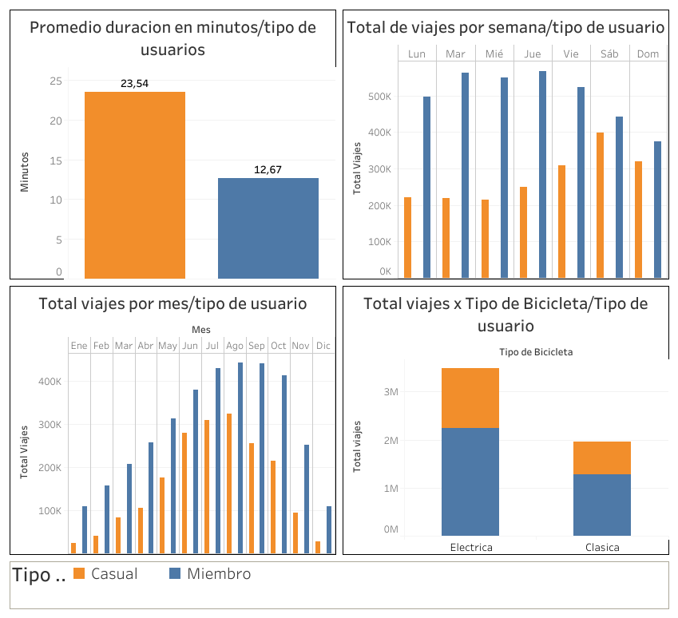

# <ins>Cyclistic Bike-Share Analysis<ins>
## Google Data Analytics Certificate - Case Study 1



## Overview
Analysis of 5.4 million bike-share trips from Chicago's Cyclistic program (March 2025 - February 2026) to identify behavioral differences between casual riders and annual members, with the goal of designing marketing strategies to convert casual riders into members.

## Business Task
How do annual members and casual riders use Cyclistic bikes differently?

## Tools Used
- **Google Sheets / Excel** → Initial data exploration and calculated columns
- **Google BigQuery** → Data combining, cleaning and analysis (SQL)
- **Tableau Desktop** → Data visualizations and dashboard
- **SQL** → Queries for descriptive analysis

## Data Source
- **Source:** Motivate International Inc. (public license)
- **Period:** March 2025 - February 2026 (12 months)
- **Size:** 5,601,635 trips (5,452,362 after cleaning)
- **Files:** 12 monthly CSV files

## Data Cleaning
- Combined 12 monthly tables using `UNION ALL` in BigQuery
- Removed trips shorter than 60 seconds (149,273 records = 2.7%)
- Removed 2 null records in `member_casual` column
- Calculated `ride_duration_seconds` from `started_at` and `ended_at` timestamps

## Key Findings

### 1. Trip Duration
| User Type | Avg Duration |
|-----------|-------------|
| Casual | 23.54 min |
| Member | 12.67 min |

➡️ Casual riders take trips **almost twice as long** as members.

### 2. Day of Week
- **Casual riders** peak on **weekends** (Saturday & Sunday) → recreational use
- **Members** peak on **weekdays** (Monday-Friday) → commuting use

### 3. Seasonality
- Both groups peak in **summer** (June-August)
- Casual riders drop **much more in winter** → weather-sensitive recreational use
- Members maintain more **stable activity year-round**

### 4. Bike Type
- Both groups prefer **electric bikes**
- Casual riders using classic bikes average **39.65 min** per trip → long leisure rides

## Top 3 Recommendations

1. **Weekend Digital Campaign** → Target casual riders on Fridays and Saturdays highlighting the cost savings of an annual membership vs. paying per ride.

2. **Peak Season Promotion** → Offer discounted annual memberships in May-June, just before the summer peak when casual riders are most active and motivated.

3. **Winter Retention Campaign** → Incentivize casual riders to become members before winter by highlighting year-round benefits like unlimited access and priority access to electric bikes on cold days.

## 📁 Repository Structure
```
cyclistic-bike-share-analysis/
├── README.md
├── sql/
│   └── cyclistic_queries.sql
├── visualizations/
│   └── dashboard.png
└── data/
    ├── 01_promediomaxmin.csv
    ├── 02_dias_semana.csv
    ├── 03_meses.csv
    └── 04_tipobici.csv
```

## Author
Data Analytics Portfolio Project  
Tools: SQL · Tableau · Google BigQuery · Spreadsheets
